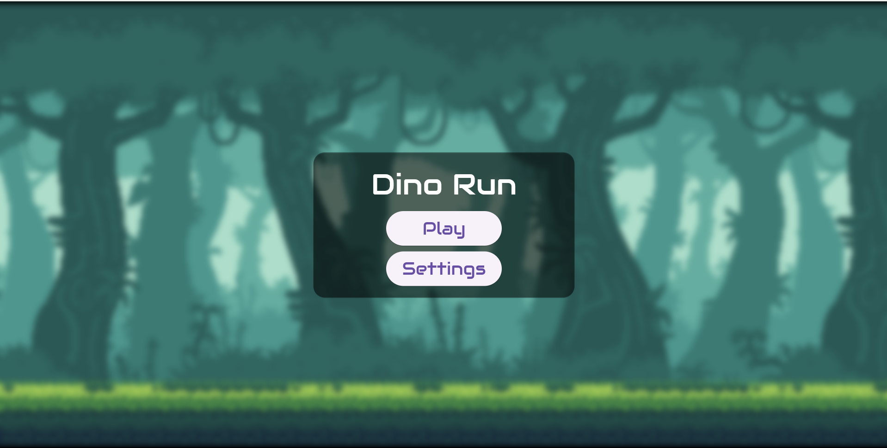

markdown
# 🦖 Dino Run

**Dino Run** is a 2D infinite side-scroller game built using the [Flame Engine](https://flame-engine.org/). It features smooth controls, pixel graphics, and an addictive gameplay loop.

---

## 📱 Demo

| Menu | Jump | Hit |
|------|------|-----|
|  |  |  |
<table>
  <tr>
    <td></td>
    <td></td>
    <td></td>
  </tr>
</table>
---

## 📦 Downloads

- 📱 [Google Play Store](https://play.google.com/store/apps/details?id=com.nobs.dino_run)  
- 🎮 [Itch.io](https://ufrshubham.itch.io/dino-run)

---

## 🛠 Build Steps

To run the project locally:

```bash
# 1. Clone the repository
git clone https://github.com/ufrshubham/dino_run

# 2. Navigate into the project folder
cd dino_run

# 3. Install dependencies
flutter pub get

# 4. Run the game (make sure a device/emulator is connected)
flutter run
````

---

## 💻 Supported Platforms

* ✅ Android
* ✅ iOS
* ⚠️ Windows (No audio support)

---

## ⚖️ License

* Source code: MIT License – see [LICENSE](LICENSE)
* Assets: Used with attribution. See:

  * [assets/images/readme.md](assets/images/readme.md)
  * [assets/audio/readme.md](assets/audio/readme.md)

---

## 🎥 Why is the code different from the YouTube series?

This project began as a learning journey with Flame. While building it, I decided to create a [YouTube tutorial series](https://www.youtube.com/playlist?list=PLiZZKL9HLmWOmQgYxWHuOHOWsUUlhCCOY). The game and videos were originally developed using Flame v0.28. However, Flame underwent major updates, including a full migration to null safety and a new API.

To keep things up-to-date:

* 🔁 I rewrote the game from scratch using the latest Flame version.
* 📦 The original version is preserved on the [`main` branch](https://github.com/ufrshubham/dino_run/tree/main).

This way, new learners can follow a working codebase and still benefit from the series.

---

## 🧩 Games Inspired by Dino Run

Here are some cool games inspired by Dino Run:

* 🎮 [Fly Dash](https://play.google.com/store/apps/details?id=io.madhank93.dashy_bird&hl=en_IN) by [Madhan Kumaravelu](https://github.com/madhank93)
* ⚔️ [Warrior Runner](https://play.google.com/store/apps/details?id=hashim4498.games.warrior_runner&hl=en_IN) by [Mohammed Hashim](https://github.com/mohammedhashim44)
* 🦕 [DinoRun](https://github.com/DetainedDeveloper/DinoRun) by [Jay](https://github.com/DetainedDeveloper)
* 🐾 [run-dino-run](https://github.com/NextFaze/run-dino-run) by [Rushi Patel](https://github.com/whimzyLive)
* 🏃 [Dino Running](https://play.google.com/store/apps/details?id=rteixeira.apps.dino_run) by [Renan Teixeira](https://github.com/renant)

Know a game inspired by Dino Run? Open a PR or send me the details to get it featured here.

---

## 💬 Join the Community

Join the [Discord server](https://discord.gg/xHu3aUQGsJ) to discuss game dev, Flame, or anything about this project.

---

> Created with ❤️ by [@ufrshubham](https://github.com/ufrshubham)


---

Let me know if you'd like this in `.md` file format directly, or want additional badges (build, license, downloads, etc.) added at the top.
```
